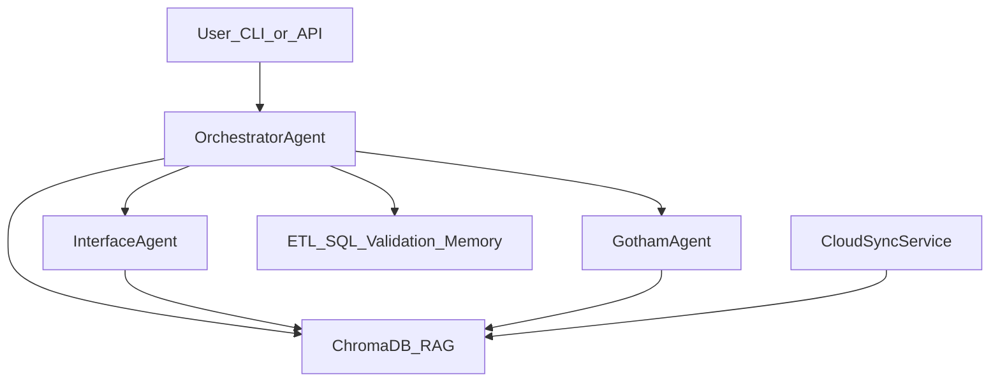

# App Builder Agent Mesh Plan

## Goal

Turn the existing ETL-focused orchestrator into an **app-building orchestrator** that routes work to:

- **Interface** — frontend (React/Next.js, UI, components, state, styling)
- **Gotham** — backend (FastAPI, SQL, architecture, APIs, infra patterns)

While keeping current ETL agents (`etl_agent`, `sql_agent`, etc.) for data-integration tasks.

**Target stack:** React/Next.js frontend + Python FastAPI backend.

---

## Current foundation (already in repo)


| Piece                        | Location                                                                       | Status                             |
| ---------------------------- | ------------------------------------------------------------------------------ | ---------------------------------- |
| Orchestrator (RAG + routing) | [ai_agent/orchestrator/orchestrator.py](ai_agent/orchestrator/orchestrator.py) | ETL-only routing today             |
| ChromaDB RAG                 | [ai_agent/rag/chroma_store.py](ai_agent/rag/chroma_store.py)                   | Local persist, file ingest         |
| FastAPI API                  | [ai_agent/api/main.py](ai_agent/api/main.py)                                   | `/orchestrate`, `/kb/*`            |
| CLI                          | [ai_agent/cli.py](ai_agent/cli.py)                                             | chat, ingest, seed                 |
| Cursor subagents (ops)       | [.cursor/agents/](.cursor/agents/)                                             | env, CI, tests, docs, etl-codebase |
| Ruflo mesh config            | [ruflo/.agents/etl_orchestrator.yaml](ruflo/.agents/etl_orchestrator.yaml)     | ETL-focused, missing yaml files    |





---

## Part 1 — Orchestrator upgrades

**File:** [ai_agent/orchestrator/orchestrator.py](ai_agent/orchestrator/orchestrator.py)

### Changes

1. **Expand `ORCHESTRATOR_SYSTEM`** to include app-building agents and routing rules:
  - `interface_agent` — UI, React/Next.js, components, CSS, UX
  - `gotham_agent` — FastAPI routes, SQL, schema, architecture, DevOps patterns
  - Keep existing ETL agents for data-pipeline tasks
  - Add rule: full-stack features may need **sequential routing** (Gotham API first, then Interface UI)
2. **Register new agents** in `self.agents` dict alongside existing four.
3. **Improve routing JSON schema** to support optional multi-step plans:

```json
{
  "reasoning": "...",
  "agent": "interface_agent | gotham_agent | etl_agent | ...",
  "task": "...",
  "store_result": true,
  "follow_up_agent": null,
  "follow_up_task": null
}
```

1. **Default fallback** — change from `etl_agent` to a neutral choice based on keywords (UI → Interface, API/SQL → Gotham).
2. **Update `/health`** in [ai_agent/api/main.py](ai_agent/api/main.py) to list new agent keys.
3. **Seed knowledge** in [ai_agent/cli.py](ai_agent/cli.py) — add React + FastAPI patterns (project structure, REST conventions, component patterns).

---

## Part 2 — New Python specialist agents

### Interface agent

**New file:** `ai_agent/agents/interface_agent.py`

- System prompt: React/Next.js expert — components, hooks, routing, Tailwind/CSS, forms, API client integration with FastAPI
- `run(task, context)` — same pattern as [ai_agent/agents/etl_agent.py](ai_agent/agents/etl_agent.py)
- Output conventions: file paths (`frontend/src/...`), component names, props interfaces

### Gotham agent

**New file:** `ai_agent/agents/gotham_agent.py`

- System prompt: backend + architecture expert — FastAPI, Pydantic models, SQL (PostgreSQL/MySQL/Oracle), migrations, service layer, repo layout, security, deployment
- Holds **project architectural knowledge** — monorepo layout, API contracts, DB schema conventions
- Can delegate SQL-heavy sub-tasks conceptually (may overlap with existing `sql_agent`; Gotham owns app DB design, `sql_agent` stays Oracle/ETL-focused)

### App project scaffold (minimal)

**New directory:** `app/` (or `fullstack-app/`)

```
app/
├── frontend/          # Next.js or Vite+React
│   └── src/
├── backend/           # FastAPI app (separate from ai_agent API)
│   └── main.py
└── README.md          # how agents should structure this repo
```

Agents reference this layout in their system prompts so generated code lands in consistent paths. The `ai_agent` API remains the **orchestration layer**; `app/backend` is the **product** being built.

---

## Part 3 — Cloud learning (recommended phased approach)

**Recommendation:** start simple, add automation in phases. Avoid building S3/GCS sync before manual + GitHub flows work.


| Phase             | Source                | Why first                                                                                        |
| ----------------- | --------------------- | ------------------------------------------------------------------------------------------------ |
| **Phase 1** (now) | Manual CLI/API ingest | Already works; zero new infra                                                                    |
| **Phase 2**       | GitHub API            | `GITHUB_TOKEN` already in [.env.example](.env.example); sync READMEs, docs, ADRs from your repos |
| **Phase 3**       | URL fetcher           | Pull public docs (React, FastAPI, MDN) on schedule                                               |
| **Phase 4**       | S3/GCS                | Enterprise specs, design PDFs, exported Confluence — when you have a bucket                      |


### New module: `ai_agent/rag/cloud_sync.py`

```python
class CloudSyncService:
    def sync_github_repo(owner, repo, paths=["README.md", "docs/"])
    def sync_urls(urls: list[str])
    def sync_all()  # orchestrates enabled sources from config
```

- Each synced document → `ChromaStore.add_document()` with metadata: `source`, `type: cloud_sync`, `synced_at`, `origin_url`
- Dedup by content hash or `origin_url` in metadata filter before re-ingest

### New API endpoints (in [ai_agent/api/main.py](ai_agent/api/main.py))

- `POST /kb/sync/github` — `{ "owner", "repo", "paths" }`
- `POST /kb/sync/urls` — `{ "urls": [...] }`
- `GET /kb/sync/status` — last sync time, doc counts by source

### New CLI commands (in [ai_agent/cli.py](ai_agent/cli.py))

- `python -m ai_agent.cli sync-github owner/repo`
- `python -m ai_agent.cli sync-urls https://...`

### Config additions to [.env.example](.env.example)

```
GITHUB_TOKEN=           # Phase 2
SYNC_URLS=              # optional comma-separated defaults
CLOUD_SYNC_ENABLED=true
```

### Optional: scheduled sync

- GitHub Actions cron or local `cron` calling CLI sync weekly
- Document in README_AI_AGENT.md

---

## Part 4 — Cursor subagents (create-subagent skill)

Add two **project subagents** in [.cursor/agents/](.cursor/agents/) for Cursor IDE delegation (parallel to Python runtime agents):

### `.cursor/agents/interface.md`

```yaml
name: interface
description: Frontend specialist for React/Next.js UI work. Use proactively for components, pages, styling, forms, client state, and FastAPI API integration from the browser.
```

Body: workflow (read `app/frontend/`, match existing patterns), output format (component + props + API calls), checklist (accessibility, responsive, error states).

### `.cursor/agents/gotham.md`

```yaml
name: gotham
description: Backend and architecture specialist for FastAPI, SQL, system design, and full project structure. Use proactively for APIs, database schema, migrations, security, and cross-layer architectural decisions.
```

Body: workflow (read `app/backend/`, `sql/`, docs), architectural principles, output format (routes, models, SQL, diagram when needed).

These complement the existing ops subagents (`env-dependencies`, `ci-pipeline`, etc.) — Interface/Gotham are **product-building** agents.

---

## Part 5 — Ruflo mesh alignment

Update [ruflo/.agents/etl_orchestrator.yaml](ruflo/.agents/etl_orchestrator.yaml):

- Add `interface-specialist` and `gotham-specialist` sub_agent triggers
- Create missing files referenced today:
  - `ruflo/.agents/interface_agent.yaml`
  - `ruflo/.agents/gotham_agent.yaml`
  - `ruflo/.agents/sql_agent.yaml` (split from [sub_agents.yaml](ruflo/.agents/sub_agents.yaml))

Update [ruflo/.claude/config.yaml](ruflo/.claude/config.yaml) — bump `max_agents`, add app-building description.

---

## Part 6 — Tests, docs, and git hygiene


| Task                          | File                                                         |
| ----------------------------- | ------------------------------------------------------------ |
| Smoke tests for new agents    | [ai_agent/tests/test_smoke.py](ai_agent/tests/test_smoke.py) |
| Test cloud sync (mock GitHub) | `ai_agent/tests/test_cloud_sync.py`                          |
| Update agent docs             | [README_AI_AGENT.md](README_AI_AGENT.md)                     |
| Add `chroma_db/` to gitignore | [.gitignore](.gitignore)                                     |


---

## Suggested implementation order

1. **Interface + Gotham Python agents** + orchestrator routing (unblocks app building immediately)
2. **Cursor subagents** `interface.md` + `gotham.md` (IDE workflow)
3. **Minimal `app/` scaffold** (Next.js + FastAPI skeleton)
4. **Phase 1 cloud** — enrich seed + manual ingest docs for React/FastAPI
5. **Phase 2 cloud** — `cloud_sync.py` + GitHub sync endpoint/CLI
6. **Ruflo YAML** + tests + docs

---

## How you will run it (end state)

```bash
# Setup
cp .env.example .env   # ANTHROPIC_API_KEY + GITHUB_TOKEN
pip install -r ai_agent/requirements.txt
python -m ai_agent.cli seed

# Sync cloud knowledge (Phase 2)
python -m ai_agent.cli sync-github your-org/your-app-docs

# Build via chat
python -m ai_agent.cli chat
# "Create a user registration page in React that calls a FastAPI /users endpoint"

# Or API
curl -X POST http://localhost:8000/orchestrate \
  -H "Content-Type: application/json" \
  -d '{"task": "Design Gotham API for orders + Interface checkout UI"}'
```

In Cursor IDE:

```
Use the gotham subagent to design the FastAPI user service
Use the interface subagent to build the React dashboard page
```

